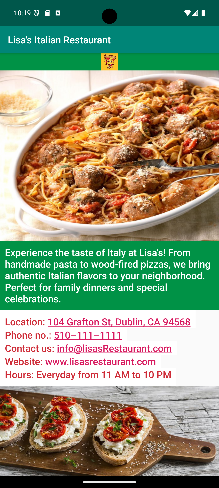

# Single Screen Restaurant Android App


Android Nanodegree - Project: Build a Single Screen App

A single-screen Android app showcasing Lisa's Italian Restaurant, featuring authentic Italian cuisine in Dublin, CA.

---

## 🏷️ Keywords & Topics

**Primary Keywords:** Android Development • Mobile App • Restaurant App • Single Screen Design • User Interface  
**Technical Stack:** Java • Android Studio • XML Layouts • Material Design • ScrollView • Intent Actions  
**Business Focus:** Restaurant Branding • Customer Engagement • Contact Integration • Local Business • Food Service  
**Industry:** Food & Beverage • Restaurant Technology • Mobile Applications • Local Business • Hospitality  
**Project Type:** Mobile Application Development | Industry: Restaurant & Food Service | Focus: Customer Experience & Business Showcase

---

## 📁 File Structure

```
├── app/
│   ├── src/
│   │   ├── main/
│   │   │   ├── java/com/example/lisasitalianrestaurant/
│   │   │   │   └── MainActivity.java                    # Main activity with restaurant info and interactions
│   │   │   ├── res/
│   │   │   │   ├── drawable/                           # Restaurant images and app icons
│   │   │   │   │   ├── italianfood.jpg                 # Main restaurant food image
│   │   │   │   │   ├── italianfood1.jpg                # Additional food showcase image
│   │   │   │   │   └── pizzaemoji.jpg                  # Pizza emoji branding image
│   │   │   │   ├── layout/                             # UI layout files
│   │   │   │   ├── values/
│   │   │   │   │   ├── strings.xml                     # Externalized text resources
│   │   │   │   │   ├── colors.xml                      # Italian-themed color palette
│   │   │   │   │   └── styles.xml                      # Material Design styling
│   │   │   │   └── mipmap-*/                           # App launcher icons (multiple densities)
│   │   │   └── AndroidManifest.xml                     # App configuration and permissions
│   │   ├── androidTest/                                # UI instrumentation tests
│   │   └── test/                                       # Unit tests
│   ├── build.gradle                                    # App-level build configuration
│   └── proguard-rules.pro                             # Code obfuscation rules
├── gradle/                                             # Gradle wrapper files
├── screenshots/
│   └── page1.png                                       # App screenshot for documentation
├── build.gradle                                        # Project-level build configuration
├── settings.gradle                                     # Project settings
├── README.md                                           # Project overview and documentation
└── LICENSE                                             # Project license information
```

---

## 🚀 Getting Started

### Prerequisites
- **Android Studio** (Arctic Fox or later)
- **Java Development Kit (JDK)** 8 or higher
- **Android SDK** with API level 21+ 
- **Gradle** 8.5+ (included with Android Studio)

### Installation & Setup
1. **Clone the repository**
   ```bash
   git clone https://github.com/sandesh21/single-screen-restaurant-android-app.git
   cd single-screen-restaurant-android-app
   ```

2. **Open in Android Studio**
   - Launch Android Studio
   - Select "Open an existing project"
   - Navigate to the cloned directory and select it

3. **Build the project**
   - Android Studio will automatically sync Gradle dependencies
   - Wait for the build to complete

4. **Run the app**
   - Connect an Android device or start an emulator
   - Click the "Run" button or press `Shift + F10`

### Project Structure
The project follows standard Android architecture with clean separation of concerns and proper resource organization.

---

## App Features

**Business Information:**
- Restaurant name and branding
- Multiple Italian food images
- Complete contact information
- Business description and hours

**Interactive Elements:**
- Clickable phone number for direct calling
- Tappable email address for quick contact
- Interactive address for map navigation
- Website link for online presence

**Technical Implementation:**
- Responsive ScrollView layout
- Material Design theming with Italian colors
- Accessibility support with content descriptions
- Externalized string resources for localization

---

## Business Details

- **Name**: Lisa's Italian Restaurant
- **Location**: 104 Grafton St, Dublin, CA 94568
- **Phone**: 510-111-1111
- **Email**: info@lisasRestaurant.com
- **Website**: www.lisasrestaurant.com
- **Hours**: Everyday from 11AM-10PM
- **Specialty**: Authentic Italian food with party reservations

---

## 📱 Screenshots

<div align="center">
  
  <p><em>Main screen showcasing restaurant information and interactive elements</em></p>
</div>

---

## Project Requirements Met

✅ Business name  
✅ Multiple business photos  
✅ Contact information (phone, email, website)  
✅ Business address  
✅ Business description  
✅ Hours of operation

---

## 👨‍💻 Author  

**Sandesh S. Badwaik**  
- Google Android Nanodegree Graduate
- Mobile App Developer
- Data Scientist & Machine Learning Engineer* 
- Specializing in Android development and data engineering
- Passionate about creating intuitive user experiences
[](https://www.linkedin.com/in/sbadwaik/)
[](https://github.com/sandesha21)

---

🌟 **If you found this project helpful, please give it a ⭐!**
